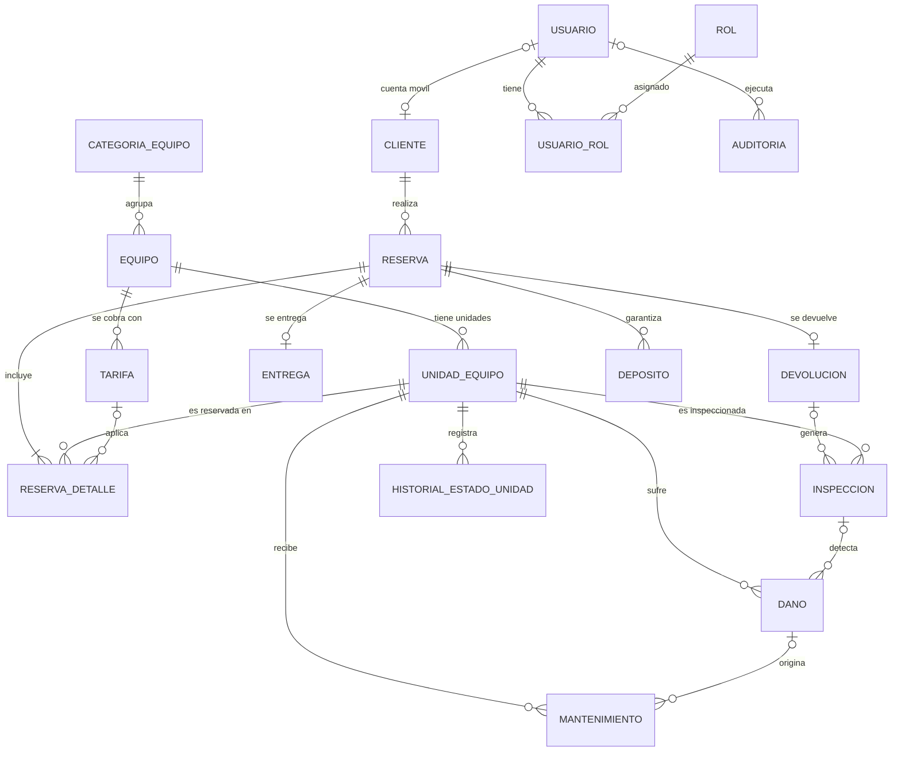

# DER lógico v0.1 — EquipRent (Clase 04)

## Convenciones
- PK = clave primaria · FK = clave foránea · UQ = unicidad · NN = obligatorio · CK = dominio

## equipo
PK equipo_id
FK categoria_id -> categoria_equipo.categoria_id (NN)
NN codigo, nombre, activo
UQ codigo (global)

## unidad_equipo
PK unidad_id
FK equipo_id -> equipo.equipo_id (NN)
NN codigo_unidad, estado
UQ codigo_unidad (global, RN-01) · UQ numero_serie (global, nullable)
CK estado ∈ {DISPONIBLE, ENTREGADA, EN_INSPECCION, MANTENIMIENTO, BLOQUEADA, BAJA}

## cliente
PK cliente_id · FK usuario_id (opcional) · NN numero_documento, nombre_completo · UQ numero_documento, email

## reserva
PK reserva_id · FK cliente_id (NN) · NN codigo, fecha_inicio, fecha_fin, estado
UQ codigo · CK fecha_fin > fecha_inicio · CK estado CANCELADA ⇒ motivo_cancelacion

## reserva_detalle
PK reserva_detalle_id · FK reserva_id, unidad_id (NN) · FK tarifa_id (opcional)
UQ (reserva_id, unidad_id) — unicidad **contextual/compuesta**

## entrega / devolucion
PK propia · FK reserva_id NN · UQ reserva_id (1:0..1)

## Relaciones

1. categoria_equipo 1 ---- N equipo
2. **equipo 1 ---- N unidad_equipo**
3. equipo 1 ---- N tarifa
4. cliente 1 ---- N reserva
5. reserva N ---- M unidad_equipo (reserva_detalle)
6. reserva 1 ---- 0..1 entrega / devolucion
7. unidad_equipo 1 ---- N dano / mantenimiento / inspeccion / historial

## Reglas que afectan el modelo
- RN-01: unidad con código único y estado → UQ codigo_unidad + NN/CK estado.
- RN-02: sin reservas solapadas → backend transaccional (consulta por rango).
- RN-04: reserva ≠ entrega → tabla entrega separada; estado de unidad no tiene RESERVADA.
- RN-05: entrega requiere confirmación o autorización → backend + CK autorizacion ⇒ autorizado_por.
- RN-10: historial no se elimina → trigger que impide DELETE.
